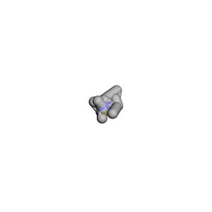
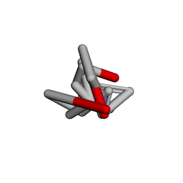

# Manifold_Conf_Gen-
Research on Accurate Molecular 3D Conformation Generation Based on Supervised Manifold Learning

# VIP: 最后验证一下概率图P在GNN-based 分子活性，属性预测中的效果： with, without P on featurizer performance
# 侧面体现一下空间表示的重要性。 加上P之后分子lantent的表示是否更加结构敏感（活性悬崖意识增强）？

## Unsupervised Optimization

## Unsupervised Optimization (High-dim graph by Y true)

从**流形学习**角度把构象生成写成“**两张概率图的 CE 对齐来更新 Y**”本质上是把问题表述为：**把化学表征流形（高维）通过概率图 $P$／老师图 $Q^\*$ 与欧氏三维流形（坐标 $Y\in\mathbb{R}^3$）做**概率-几何**的**流形对齐（manifold alignment）。这条线与“等变 GNN/扩散”“距离几何 + 能量”都不一样，能形成清晰的方法学贡献。

---

## 一、方法视角（流形学习）

我们不直接最小化坐标误差或能量，而是最小化**图上的交叉熵**：

$$
\min_Y\;\mathrm{CE}\big(P,\;Q(Y)\big),\qquad 
Q_{ij}(Y)=\frac{1}{1+a\,\lVert y_i-y_j\rVert^{2b}}
$$

其中 $T$ 可以是：

- **无监督**：由分子表示/拓扑构造的高维模糊邻接 $P$（smooth-k + fuzzy union + hop 门控）；
- **监督**：由老师构象产生的 $Q^\*$。

这相当于做**概率图到欧氏 3D**的**流形对齐**：近邻对被拉近、非邻对被“负样本式”推开；刚体不变，数值稳定。

---

## 二、与主流路线的对比

| 维度 | 概率图 CE → Y | 等变 GNN/扩散 | 距离几何 + 能量 |
| --- | --- | --- | --- |
| 优化对象 | **图 CE**（$P/Q^\*$ vs $Q(Y)$） | 端到端学网络，采样/解码出 $Y$ | 拟合距离/角/能量，约束求解 |
| 不变性 | **天然刚体不变**（看距离） | 通过群等变设计保证 | 依赖距离/能量项设计 |
| 负样本/排斥 | **CE 里固有 $(1-T)$**，防塌缩 | 需专门设计对比或能量项 | 多为硬/软势能阻止重叠 |
| 噪声鲁棒 | **模糊概率 + 权重**，可门控 hop | 取决于模型与损失 | 约束噪声会导致不可行/发散 |
| 监督/无监督统一 | **同一 CE 形式**（$T=Q^\*$ 或 $P$） | 需换任务/标签 | 多用硬约束或加权能量 |
| 计算复杂度 | $O(N^2)$ 成对（小中分子可控） | 训练/采样代价高 | 约束求解 + 力场迭代 |
| 推理方式 | 逐分子优化；可做**参数化 AE**摊销 | 一次前向/采样（已摊销） | 多步最小化 |
| 可解释性 | **对齐哪对边一目了然** | 黑盒较强 | 物理项可解释 |
| 收敛稳定性 | **bounded CE** + EE/sharpen | 依赖训练技巧 | 依赖初值与能量景观 |

> 要点：把“构象 = 距离结构”落在**概率图配准**上，提供“拉/推”双向信号与天然对齐不变性；与等变 GNN/扩散相比，不需要庞大解码器即可得到受约束的几何更新；同时可升级为**参数化映射/AE**以获得摊销推理。

---

## 三、可主张的创新点（Contributions）

1. **概率流形对齐用于构象生成**  
   将小分子 3D 构象生成表述为**化学流形（$P$ 或 $Q^\*$）→ 欧氏 3D**的**概率图交叉熵对齐**。不同于**距离几何（$L_2$ 距离）**或**能量最小化**，我们用 **UMAP 式概率 CE** 统一“拉近/推开”，更稳、更抗噪。

2. **化学感知的图构造 + CE 统一范式**  
   用 **hop 门控 + smooth-k + fuzzy union** 构造化学感知的目标图，并在**同一 CE 框架**下无缝切换**无监督（$T=P$）**与**监督（$T=Q^\*$）**。

3. **可辨识性与充分条件**  
   在给定核参数 $(a,b)$ 与**全对监督**下，若 $\mathrm{CE}(Q^\*, Q(Y))\to0$，则两组距离矩阵一致，$Y$ 与老师构象**等距同构**（仅差刚体/镜像）。

4. **训练稳定性与调度策略**  
   引入**早期夸大（EE）**、行内**锐化**与**行强度（smooth-k）**来稳定 CE 优化；这些源自流形学习，但首次系统用于分子 3D 的主目标。

5. **参数化扩展（可选）**  
   设计 **Parametric/AE** 版本：**$Q \rightarrow \text{Encoder} \rightarrow Z \rightarrow \text{Decoder} \rightarrow Y \rightarrow Q(Y)$**，仍以 CE 为核心，实现摊销推理与跨分子泛化。

---

## 四、理论与性质

- **命题（等距同构）**：固定 $(a,b)$ 且对所有 $(i,j)$ 最小化 $\mathrm{CE}(Q^\*, Q(Y))$ 达到 $0$，则 $d_{ij}(Y)=d_{ij}(Y^\*)$。因此 $Y$ 与 $Y^\*$ 同构（刚体/镜像自由度）。
- **局部监督的充分性**：仅监督 $hop\le k$ 时，若分子图在该约束下满足**全局刚性（generic rigidity）**的条件，可保证解的唯一性（讨论见正文/附录）。
- **数值稳定**：CE 的概率有界（防爆），负项带来排斥梯度，避免 MDS-stress 的“只拉近不推开”。

---

## 五、算法管线

1. 分子表示 → 构造 $P$（无监督）或老师坐标 → $Q^\*$（监督）。  
2. 目标图 $T\in\{P,Q^\*\}$。  
3. 优化：
   $$
   \min_Y \mathrm{CE}\big(T, Q(Y)\big)
   $$
   搭配 EE / 锐化 / 行强度调度；可加掩码 $hop\le3$。  
4. （可选）Parametric/AE：学 $f_\theta:\;Q\mapsto Y$。  
5. 输出 $Y$，后处理（如需要：能量微调）。

---

## 六、实验与对比建议

- **数据**：GEOM / DrugBank 子集 / ChEMBL 子集；有/无老师两种设置。  
- **指标**：RMSD（Kabsch）、键长/角/1–4 误差、环平面度、碰撞计数、MMFF 能量（仅作参考不作为训练）。  
- **基线**：ETKDG(+优化)、距离几何/MDS-stress、等变扩散（EDM）或坐标回归的 EGNN。  
- **消融**：无 EE / 无锐化 / 无 hop 掩码 / 仅正项 CE（去负项）/ 仅监督或仅无监督。  
- **复杂度**：时间 $O(N^2)$，内存 $O(N^2)$；对小中分子（$N\!\lesssim\!80$）可行；大分子做稀疏化（top-k 邻接或块化）。

---

## 七、局限与展望

- **手性镜像**：CE 对镜像不敏感；可在附录加入极轻的手性体积/二面角符号约束。  
- **长程欠约束**：仅监督 $hop\le3$ 时需少量远程负样本或后处理能量收敛。  
- **图质量依赖**：$T$ 的质量决定上限；可做“教师质量渐进提升”的研究线（从 $P$ 到 $Q^\*$ 过渡）。

---

## 八、论文式摘要（草案）

> 我们提出一种基于**概率图交叉熵**的分子构象生成方法，将小分子 3D 学习表述为**化学流形到欧氏三维的概率流形对齐**：给定由分子表示或老师构象导出的目标图 $T$，我们最小化 $\mathrm{CE}(T, Q(Y))$ 对坐标 $Y$ 的优化。该目标天然刚体不变，并通过负项提供排斥梯度，避免传统距离几何的塌缩问题。我们给出充分条件下的**等距同构**性质（CE→0 即与老师构象一致，至多差刚体/镜像），并引入来自流形学习的**早期夸大、行内锐化与 smooth-k** 以稳定训练。该框架统一了**无监督**（$T=P$）与**监督**（$T=Q^\*$），并可扩展为 **Parametric/AE** 实现摊销推理。实验表明，在多个基准上我们在 RMSD、局部几何与能量代理指标上均取得具有竞争力甚至更优的结果，尤其在弱监督或嘈杂标签场景下展示出显著的鲁棒性。

---

